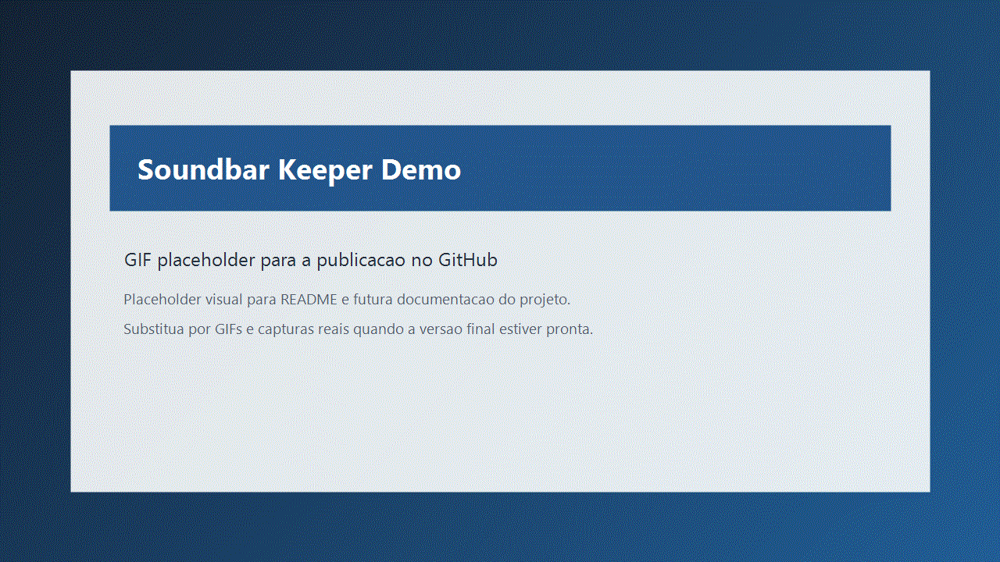
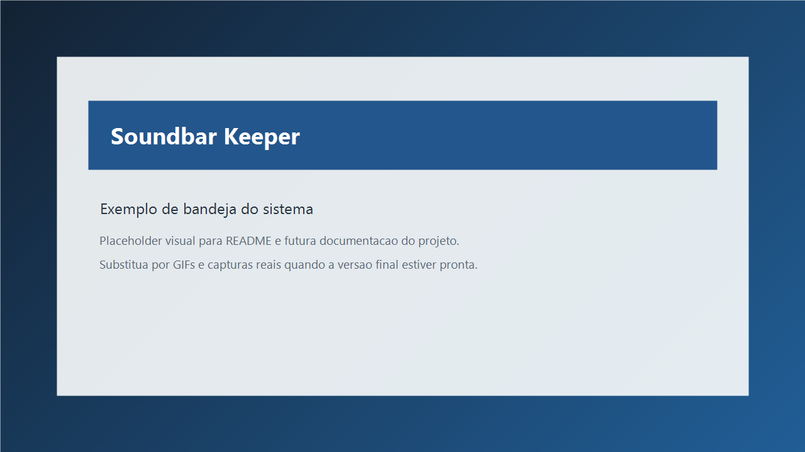

# Soundbar Keeper

Utilitario para Windows que mantem soundbars Bluetooth ativas enviando um fluxo de audio continuo em WASAPI compartilhado apenas quando o dispositivo configurado estiver selecionado como saida padrao do sistema.




## Descricao do projeto

Muitas soundbars Bluetooth entram automaticamente em modo de espera quando passam algum tempo sem receber audio. O Soundbar Keeper evita esse comportamento usando um stream continuo e extremamente baixo, herdado da logica da V6, somente quando a soundbar desejada estiver ativa no Windows.

## Problema que resolve

O projeto reduz a frustracao causada por soundbars que desligam sozinhas entre notificacoes, pausas curtas ou momentos de silencio. Em vez de depender de musica tocando o tempo todo, o aplicativo mantem um fluxo discreto para ajudar a preservar a conexao e evitar standby por ausencia de audio.

## Como funciona

1. O app inicia em segundo plano.
2. Ele observa qual e a saida padrao de audio do Windows.
3. Quando a saida corresponde a soundbar configurada, o app inicia um stream estereo continuo e muito baixo.
4. O sinal usa multiplas frequencias suaves e um envelope leve para reduzir a chance de o firmware interpretar o fluxo como silencio.
5. Um watchdog monitora o callback de audio e tenta reabrir o stream se outro app interromper o fluxo.
6. Quando outro dispositivo e selecionado, o stream e pausado automaticamente.
7. Se a soundbar voltar a ser a saida padrao, o keep-alive e retomado.

## Tecnologias utilizadas

- Python
- NumPy
- SoundDevice
- PyStray
- Pillow

## Requisitos

- Windows 10 ou Windows 11
- Python 3.11 ou superior
- Uma soundbar Bluetooth cujo nome possa ser identificado pelo Windows

## Instalacao

```powershell
git clone https://github.com/camilagoulartsoares/soundbar-keeper.git
cd soundbar-keeper
python -m venv .venv
.venv\Scripts\Activate.ps1
python -m pip install --upgrade pip
python -m pip install -e .
```

## Execucao

```powershell
python -m soundbar_keeper
```

Apos iniciar, o aplicativo permanece em segundo plano, exibe um icone na bandeja do sistema e bloqueia multiplas instancias simultaneas.

## Como configurar

Na primeira execucao, o Soundbar Keeper cria automaticamente um arquivo JSON em:

```text
%LOCALAPPDATA%\SoundbarKeeper\config.json
```

Se existir uma configuracao antiga em `%LOCALAPPDATA%\SoundbarKeeperV6\config.json`, ela sera migrada automaticamente.

Exemplo de configuracao:

```json
{
  "device_name_patterns": ["Philips", "TAB4000"],
  "tone_frequency_hz": 17500.0,
  "frequencies_hz": [180.0, 420.0, 950.0, 2200.0],
  "volume": 0.00035,
  "sample_rate_hz": 48000,
  "block_size": 960,
  "watchdog_seconds": 2.0,
  "check_interval_seconds": 3.0,
  "keep_pc_awake": true,
  "auto_start_with_windows": true,
  "start_paused": false,
  "log_level": "INFO"
}
```

Campos importantes:

- `device_name_patterns`: lista de nomes ou trechos de nomes que identificam a soundbar.
- `frequencies_hz`: frequencias usadas no fluxo continuo da V6.
- `volume`: amplitude base do sinal. Valores muito baixos sao recomendados.
- `sample_rate_hz`: taxa de amostragem preferida.
- `block_size`: tamanho do bloco de audio.
- `watchdog_seconds`: tempo maximo sem callback antes de reiniciar o stream.
- `check_interval_seconds`: intervalo entre verificacoes da saida padrao.
- `keep_pc_awake`: evita idle de sistema enquanto o app estiver ativo.
- `auto_start_with_windows`: controla a inicializacao automatica.

Voce tambem pode abrir o arquivo de configuracao diretamente pelo menu do icone na bandeja.

Para descobrir o nome exato do dispositivo de audio:

```powershell
python -m soundbar_keeper --list-devices
```

## Como instalar automaticamente

Para instalar o pacote e registrar a inicializacao com o Windows:

```powershell
installer\install.bat
```

O script:

- instala o projeto em modo editavel
- registra o aplicativo na pasta Startup do Windows
- deixa o comando pronto para execucao local

## Como remover

Para remover a inicializacao automatica e desinstalar o pacote:

```powershell
installer\uninstall.bat
```

## Logs

Os logs ficam em:

```text
%LOCALAPPDATA%\SoundbarKeeper\logs\
```

## Estrutura do projeto

```text
soundbar-keeper/
|-- assets/
|-- docs/
|-- installer/
|-- src/
|   `-- soundbar_keeper/
|-- CHANGELOG.md
|-- CONTRIBUTING.md
|-- LICENSE
|-- README.md
|-- pyproject.toml
`-- requirements.txt
```

## Limitacoes

- O projeto depende do nome do dispositivo informado pelo Windows e acessivel ao Python.
- Nem toda soundbar responde da mesma forma ao perfil de audio continuo da V6.
- A deteccao da troca de dispositivo padrao e feita por verificacao periodica, nao por evento nativo do Windows.
- O watchdog reduz falhas causadas por outros apps, mas nao consegue vencer um temporizador fisico interno da propria soundbar.
- O app foi pensado para Windows e nao pretende suportar Linux ou macOS.

## Licenca

Distribuido sob a licenca MIT. Consulte o arquivo [LICENSE](LICENSE).

## Contribuicao

Contribuicoes sao bem-vindas. Consulte [CONTRIBUTING.md](CONTRIBUTING.md) para orientacoes de desenvolvimento e testes manuais recomendados.

## Roadmap

- Interface grafica (GUI)
- Instalador (.exe)
- Atualizador automatico
- Configuracao de frequencia
- Configuracao de volume
- Selecao de dispositivo
- Multiplas soundbars
- Estatisticas de funcionamento
